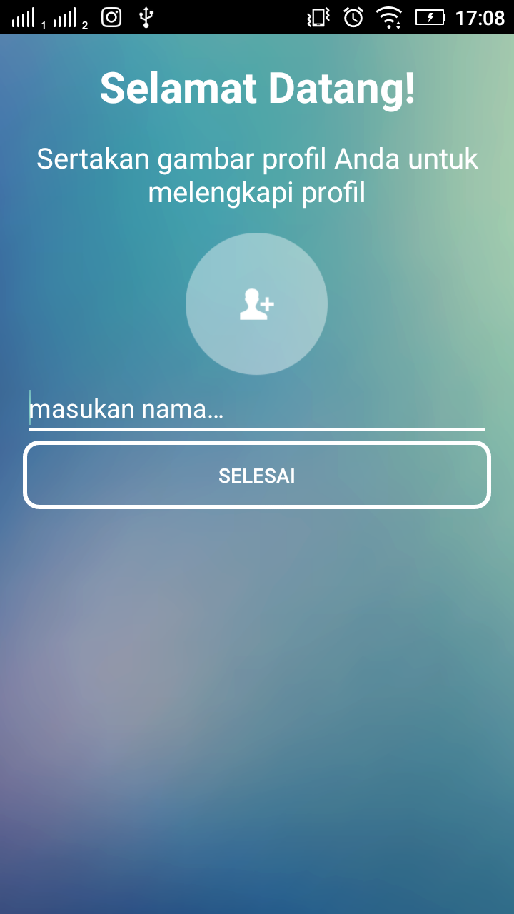
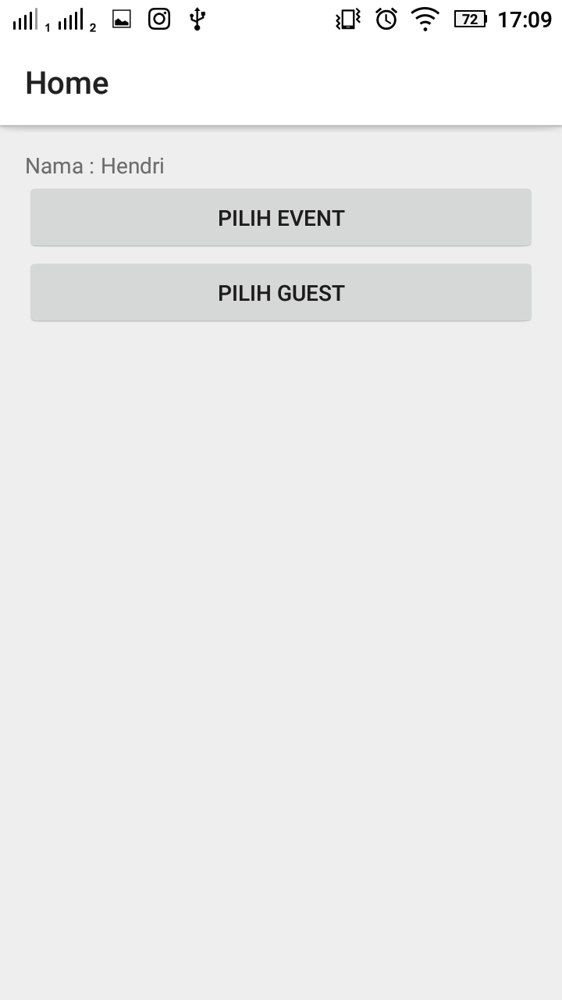
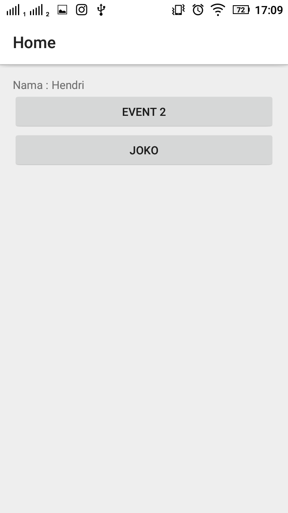
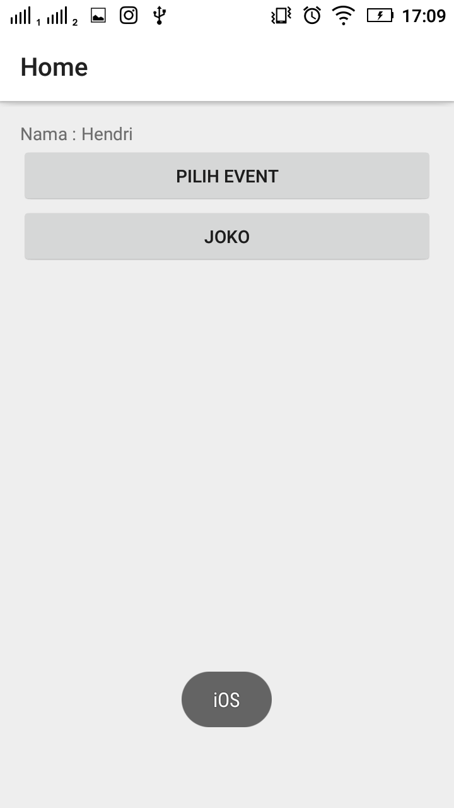
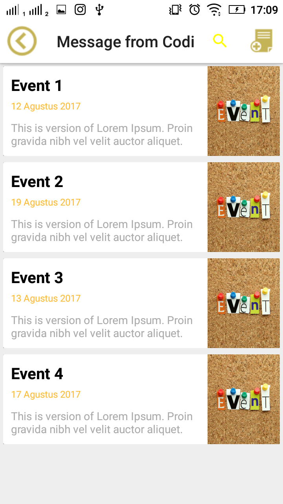
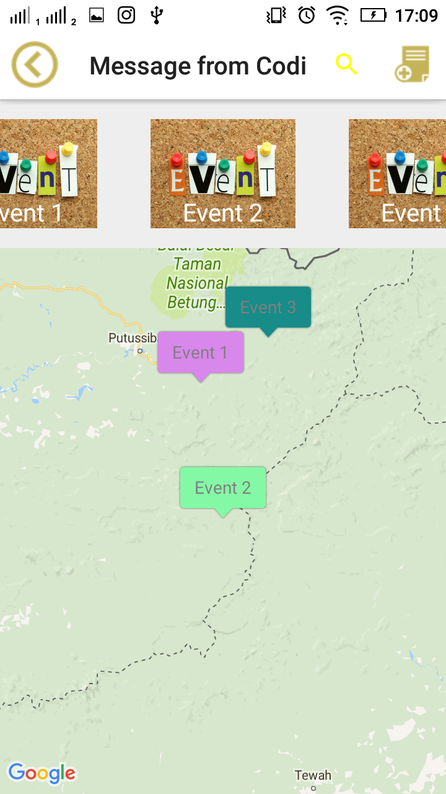
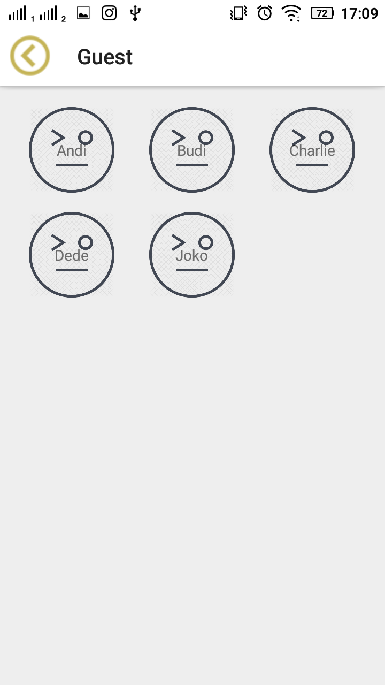

# learn-android

[](https://app.codacy.com/app/berviantoleo/learn-android_2?utm_source=github.com&utm_medium=referral&utm_content=bervProject/learn-android&utm_campaign=Badge_Grade_Settings)
[](https://travis-ci.org/bervProject/learn-android)

Learn build simple Android Application. Some component have custom layout. Feel free to learn how to customize it.

Component use in this application (also link to the Reference) :

1. [GridView](https://developer.android.com/guide/topics/ui/layout/gridview.html) - Using in GuestActivity
2. [ListView](https://developer.android.com/guide/topics/ui/layout/listview.html) - Using in EventActivity:EventFragment
3. [Retrofit](http://square.github.io/retrofit/) - Using in GuestActivity : HttpService
4. [Realm](https://realm.io/docs/java/latest/) - Using in any activity (Guest)
5. [Butterknife](http://jakewharton.github.io/butterknife/) - Using in any adapter
6. [Maps API](https://developers.google.com/maps/documentation/android-api/) - Using in Map View (within slider)
7. [ViewPager](https://developer.android.com/training/animation/screen-slide.html) - Using in photos slider
8. [Menu/ActionBar](https://developer.android.com/training/appbar/actions.html)

## Screen

### 1. Home Screen



Screen 1 - Default

### 2. Choose Event or Guest



Screen 2 - Default Screen



Screen 2 - Filled by Event



Screen 2 - Filled by Guest and Show Phone OS dependent to Guest

### 3. Screen Choose Event



Screen 3 - Choose Event (with List View)



Screen 3 - Choose Event (with Map View)

#### 4. Screen Choose Guest



Screen 4 - Choose Guest (with Grid View)

# License
```
   Copyright 2017 berviantoleo
   
   Licensed under the Apache License, Version 2.0 (the "License");
   you may not use this file except in compliance with the License.
   You may obtain a copy of the License at

       http://www.apache.org/licenses/LICENSE-2.0

   Unless required by applicable law or agreed to in writing, software
   distributed under the License is distributed on an "AS IS" BASIS,
   WITHOUT WARRANTIES OR CONDITIONS OF ANY KIND, either express or implied.
   See the License for the specific language governing permissions and
   limitations under the License.
```
