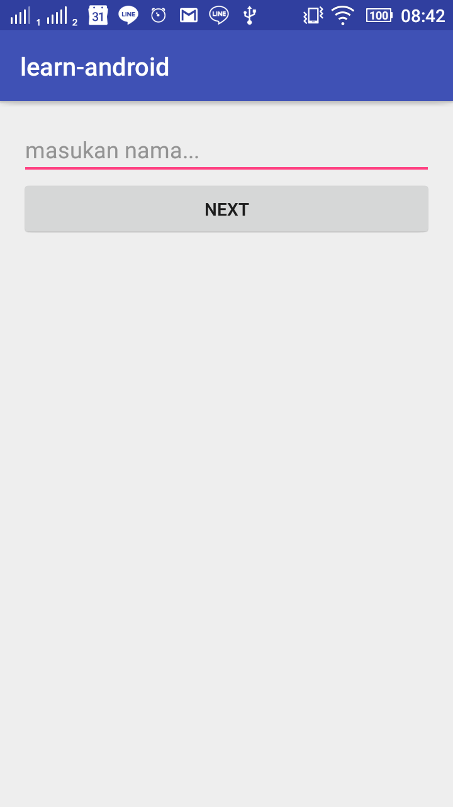
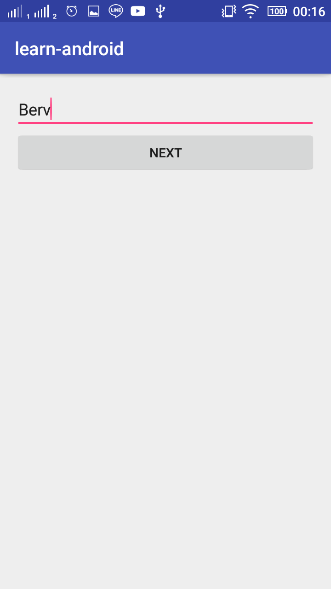
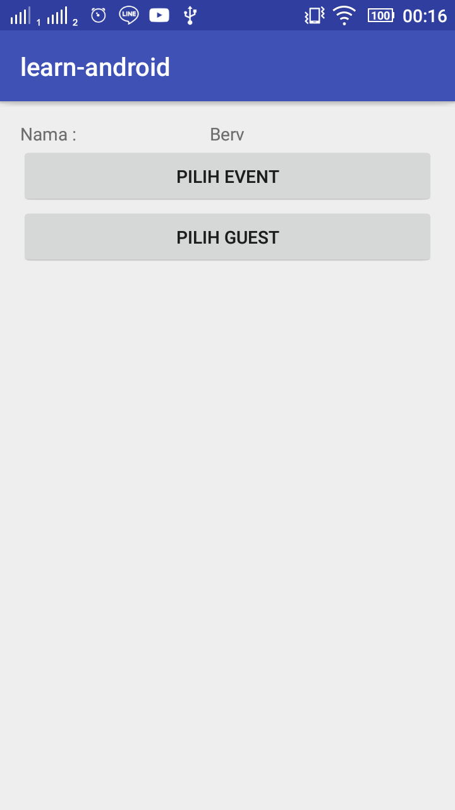
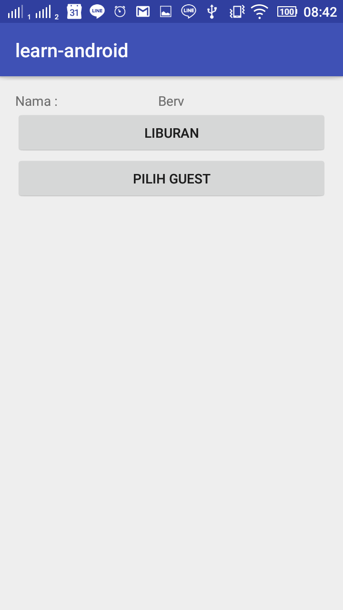
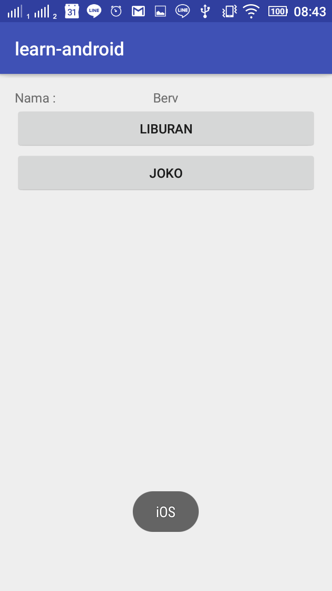
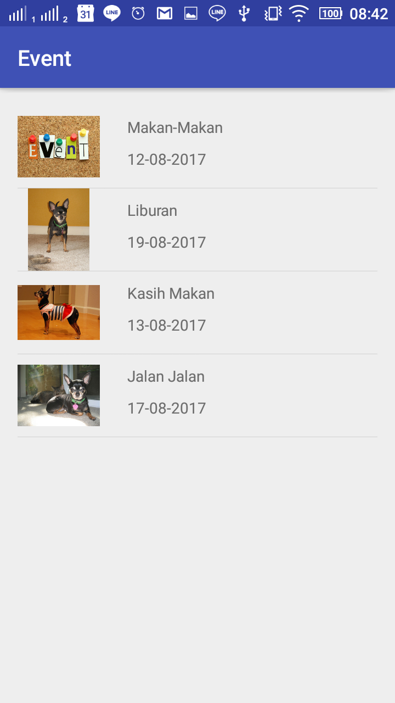
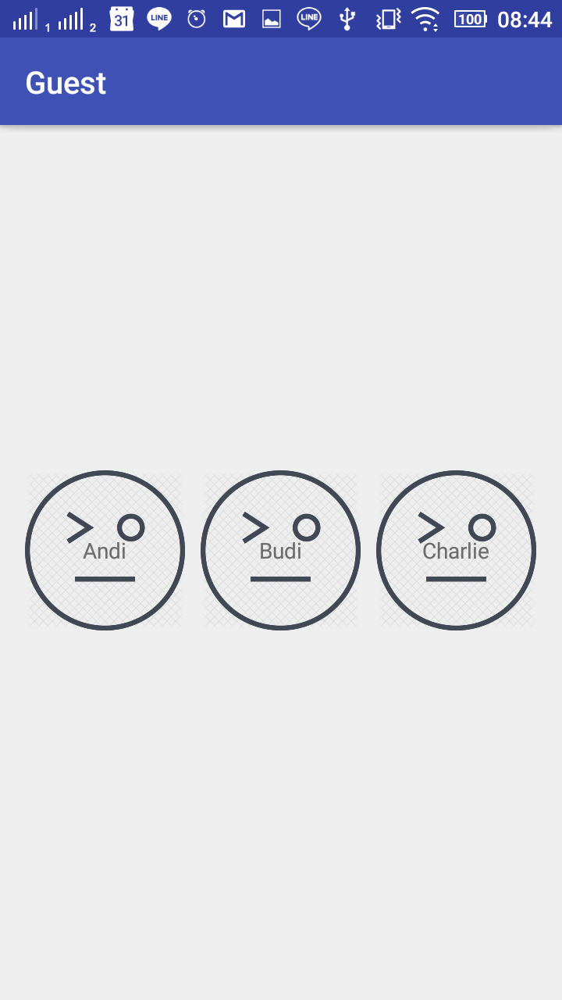

# learn-android
Learn build simple android app

## Screen

### 1. Home Screen

Screen 1 - Default

Screen 1 - Filled

### 2. Choose Event or Guest

Screen 2 - Default Screen

Screen 2 - Filled by Event

Screen 2 - Filled by Guest and Show Phone OS dependent to Guest

### 3. Screen Choose Event

Screen 3 - Choose Event (with List View)

#### 4. Screen Choose Guest

Screen 4 - Choose Guest (with Grid View)